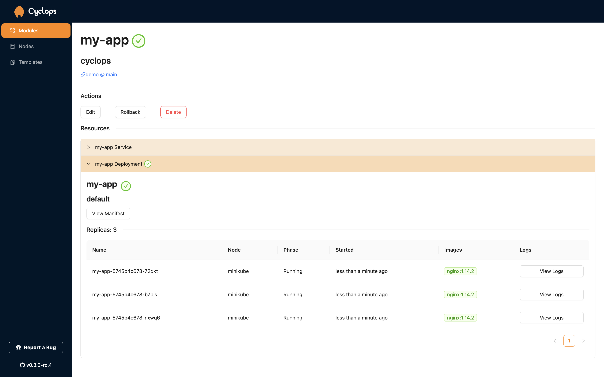

<p align="center" width="100%">

<p/>
<h1></h1>
<p align="center">Customizable UI for Kubernetes Workloads 👁️</p>

<div align="center">
    <a href="https://github.com/cyclops-ui/cyclops/blob/main/LICENSE"></a>
    <a href="https://landscape.cncf.io/?item=app-definition-and-development--application-definition-image-build--cyclops"></a>
    <a href="https://github.com/cyclops-ui/cyclops/actions/workflows/web.yaml"></a>
    <a href="https://github.com/cyclops-ui/cyclops/actions/workflows/ci.yml"></a>
</div>


Welcome to Cyclops, a powerful user interface for managing and interacting with Kubernetes clusters. Cyclops is designed
to simplify the management of containerized applications on Kubernetes, providing an intuitive and user-friendly
experience for developers, system administrators, and DevOps professionals. Divide the responsibility between your
infrastructure and your developer teams so everyone can play to their strengths. Automate your processes and shrink
the window for deployment mistakes. [Find out more!](https://cyclops-ui.com)



Find out how to [install](https://cyclops-ui.com/docs/installation/prerequisites) it to your cluster on our landing page
and give it a go! (~10 minute tutorial)

[//]: # "## :star2: Supporters"
[//]: # "<p>"
[//]: # '    <a href="https://github.com/cyclops-ui/cyclops/stargazers">'
[//]: # '        '
[//]: # "    </a>"
[//]: # "</p>"
[//]: # "[]"

## :gear: Install

⚠️ Before installing Cyclops, make sure you have all the [prerequisites](https://cyclops-ui.com/docs/installation/prerequisites) ⚠️

Cyclops can either be installed manually by applying the latest manifest or with the [Glasskube Kubernetes Package Manager](https://github.com/glasskube/glasskube/).

To install Cyclops using `kubectl` into your cluster, run commands below:

```bash
kubectl apply -f https://raw.githubusercontent.com/cyclops-ui/cyclops/v0.3.0/install/cyclops-install.yaml
```

It will create a new namespace called `cyclops` and deploy everything you need for your Cyclops instance to run.

Now all that is left is to expose Cyclops server outside the cluster:

```bash
kubectl port-forward svc/cyclops-ui 3000:3000 -n cyclops
```

You can now access Cyclops in your browser on [http://localhost:3000](http://localhost:3000).

## :floppy_disk: Templates

Every Cyclops instance comes with a couple of predefined templates, feel free to use and abuse them!

Helm charts used for these templates can be found [here](https://github.com/cyclops-ui/templates). You can use this repo as a guide if you want to create your own templates. More information on creating your own can be found on our [web](https://cyclops-ui.com/docs/templates/).

## :chart_with_upwards_trend: Future work

- RBAC
- support for accessing charts stored on private GitHub repositories
- Git as manifest destination
- Customizable Module details page

Feel free to suggest features you would like to see!
