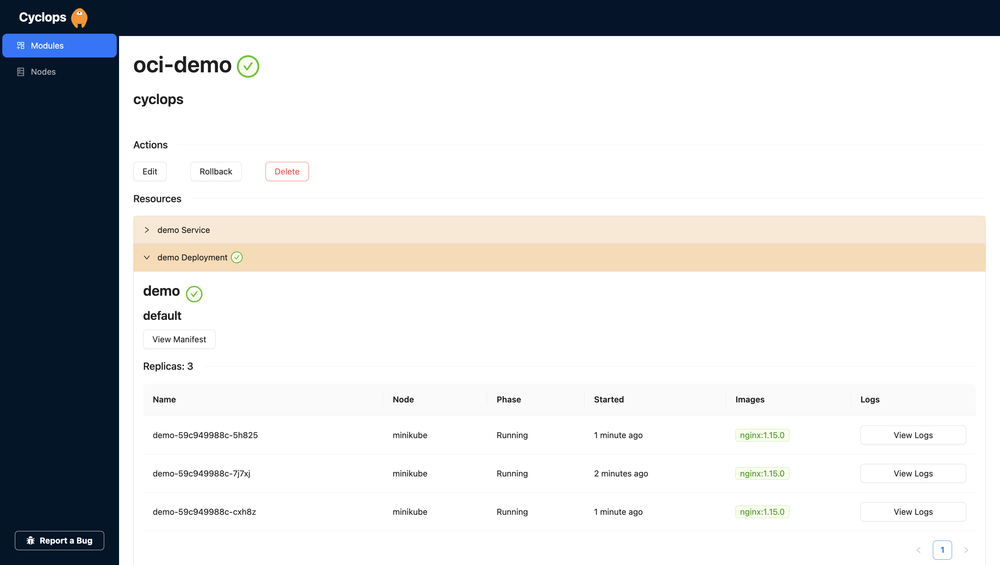

# OCI blog post

If you are using Kubernetes, there's a fair chance you are using Helm or at least considered to. This article will guide you on how to publish your Helm charts in a less conventional way - using OCI-based registries.

First of all, we will briefly cover what OCI-based registries are and how they can help us, and after some theory, we will create a Helm chart, push it to the OCI registry, and actually deploy something using it.

### Show us your support 🙏🏻


Before we start, we want to mention that we scheduled our[first release on Product Hunt](https://www.producthunt.com/products/cyclops)! Click the notify me button to be alerted when we are out and ready to receive your feedback 🔔

We would love it if you starred our [repository](https://github.com/cyclops-ui/cyclops) and helped us get our tool in front of other developers ⭐

# Helm OCI-based registries

Helm repositories are used to store Helm charts. Using them, we can publish and version our applications as packaged Helm charts others can install into their cluster. They also allow for easier versioning and rollback of resources. All in all, a single, centralized place to store your Helm charts.

Under the hood, a Helm repository is a simple HTTP server that serves an `index.yaml` file that contains information about charts stored in that repository, like versions, descriptions, and URLs on where to download chart contents (usually on the same server). Read more about `index.yaml` file [here](https://helm.sh/docs/topics/chart_repository/#the-index-file).

OCI stands for [Open Container Initiative](https://opencontainers.org/), and its goal as an organization is to define a specification for container formats and runtime.

At first glance, it does not seem related to the Helm repositories we just mentioned; at least for me it wasn’t. OCI registries mostly host container images, but we can store different types of content there. One of the types we can host is Helm charts!

With such a registry, you can host all your images and Helm charts in the same place. On top of that, you don’t need to maintain a Helm repository `index.yaml` file, which makes the management of your chart easier.

You can serve the exact same chart on a Helm repository and a container (OCI) registry; the only difference between those two approaches is how you maintain the charts.

You can use multiple different container registries to store Helm charts:

- [Amazon ECR](https://docs.aws.amazon.com/AmazonECR/latest/userguide/push-oci-artifact.html)
- [Azure Container Registry](https://docs.microsoft.com/azure/container-registry/container-registry-helm-repos#push-chart-to-registry-as-oci-artifact)
- [Docker Hub](https://docs.docker.com/docker-hub/oci-artifacts/) (used in this demo)
- [Google Artifact Registry](https://cloud.google.com/artifact-registry/docs/helm/manage-charts)
- [Harbor](https://goharbor.io/docs/main/administration/user-defined-oci-artifact/)
- [IBM Cloud Container Registry](https://cloud.ibm.com/docs/Registry?topic=Registry-registry_helm_charts)
- [JFrog Artifactory](https://www.jfrog.com/confluence/display/JFROG/Docker+Registry)

# Getting our hands dirty

Now that we have our basics down, let's see those OCI charts in practice and use them to deploy our applications. We will create a chart, push it to DockerHub, and then use it to deploy our apps in a Kubernetes cluster. In order to deploy resources from the chart we defined into a Kubernetes cluster, we are going to use Cyclops.

## Creating a Helm chart on OCI registry

Firstly, we are going to create a Helm chart. To create a chart, create a new directory

```bash
mkdir oci-demo
```

and add the files listed below to the created directory.  Feel free to customize the chart to fit your needs, but for the sake of this demo, we are going to create a basic one with the following structure:

```
.
└── oci-demo
    ├── Chart.yaml                 # YAML file containing information about the chart
    ├── templates                  # Directory of templates that, when combined with values, will generate valid Kubernetes manifest files.
    │         ├── deployment.yaml  # K8s resources are separated into multiple files. Feel free to add more or change existing
    │         └── service.yaml
    ├── values.schema.json         # JSON Schema for imposing a structure on the values.yaml file
    └── values.yaml                # The default configuration values for this chart
```

You can find out more about each of those files/directories on Helm's [official docs](https://helm.sh/docs/topics/charts/).

### Chart.yaml

Let's start with `[Chart.yaml](https://helm.sh/docs/topics/charts/#the-chartyaml-file)`:

```yaml
# Chart.yaml

apiVersion: v1
name: oci-demo
version: 0.0.0
```

Not to go into detail, I'm going to `302` you to the Helm docs.

### templates folder

The next step is defining what Kubernetes resources our packaged application need. We define those in the `/templates` folder. As seen in the chart structure from earlier, we are going to add only a `deployment` and a `service` to our application.

Contents of those files are below:

```yaml
# templates/deployment.yaml

apiVersion: apps/v1
kind: Deployment
metadata:
  labels:
    app: {{ .Values.name }}
  name: {{ .Values.name }}
spec:
  replicas: {{ .Values.replicas }}
  selector:
    matchLabels:
      app: {{ .Values.name }}
  template:
    metadata:
      labels:
        app: {{ .Values.name }}
    spec:
      containers:
      - image: {{ .Values.image -}}:{{ .Values.version }}
        name: {{ .Values.name }}
        ports:
        - containerPort: 80
          name: http

```

and

```yaml
# templates/service.yaml

{{- if .Values.service }}
apiVersion: v1
kind: Service
metadata:
  name: {{ .Values.name }}
  labels:
    app: {{ .Values.name }}
spec:
  type: LoadBalancer
  ports:
    - port: 80
      targetPort: 80
      protocol: TCP
      name: http
  selector:
    app: {{ .Values.name }}
{{- end }}

```

### values definition

In the `/templates` folder we defined, obviously, just the templates. It would be a good idea to define default values for those. We are going to use `values.yaml` for that:

```yaml
name: demo
replicas: 3

image: nginx
version: 1.14.2

service: true
```

These are default values, and anybody using your chart will most probably want to change those. But what happens if someone using your chart messes up values by providing invalid data? For example, setting `replicas: two` or `service: no`. Another thing that can get messed up is the name of the value, so somebody might use `instance: 3` instead of `replicas: 3`.

Both of these examples seem pretty obvious and something you wouldn’t mess up, but as your chart grows, so does your `values.yaml` file. A great example is the Redis chart by Bitnami. I encourage you to scroll through its [values file](https://github.com/bitnami/charts/blob/main/bitnami/redis/values.yaml). See you in a minute!

Now that you are back, you probably understand why validating values and defining their structure makes sense. Let’s do the same for our chart.

But first, let’s define what are the rules of this validation:

- `service` is type boolean
- `name`, `image` and `version` are strings
- `replicas` is an integer
- `replicas` is ≥ 0
- allow only certain values for `version`; let those be `1.14.1`, `1.14.2`, or `1.15.0`

There are quite a few rules packed for such short values file! However, having them in place gives us the confidence to deploy the chart without worrying about making mistakes.

Now that we have those defined, our JSON schema will look like the following:

```json
{
  "properties": {
    "name": {
      "description": "Application name",
      "type": "string"
    },
    "replicas": {
      "description": "Number of replicas",
      "type": "integer",
      "minimum": 0
    },
    "image": {
      "description": "Container Image",
      "type": "string"
    },
    "version": {
      "description": "Container image version",
      "type": "string",
      "enum": [
        "1.14.1",
        "1.14.2",
        "1.15.0"
      ]
    },
    "service": {
      "description": "Expose your application",
      "type": "boolean"
    }
  },
  "order": [
    "name",
    "replicas",
    "image",
    "version",
    "service"
  ],
  "title": "Values",
  "type": "object"
} 
```

You can find more on how to write a JSON schema for a Helm chart in the [Helm docs](https://helm.sh/docs/topics/charts/#schema-files).

### Pushing to Docker Hub

If you don’t already have a Docker Hub account, you should create one to host your charts.

To push our chart to an OCI registry, we will need to package the chart into a tarball with the following command:

```bash
helm package oci-demo
```

There should now be a tarball file called `oci-demo-0.0.0.tgz` .

Next, you will need to sign in to Docker Hub using Helm:

```bash
helm registry login registry-1.docker.io -u {username}
```

And finally, push your chart to the remote registry:

```bash
helm push oci-demo-0.0.0.tgz oci://registry-1.docker.io/{username}
```

Check your artifacts on [Docker Hub](https://hub.docker.com/), and you should see your newly created Helm chart. If you click on the chart, you’ll see more info about the chart and its versions.


## Using OCI charts

We now have our Helm chart locked and loaded, so let’s use it. First of all, let's spin up a Kubernetes cluster. If you already have a running Kubernetes cluster, feel free to use it and skip this step.

### Create a minikube Cluster

When I want to play around with a new Kubernetes tool, I try it out on a minikube cluster. Minikube is basically a Kubernetes cluster you can run on your own machine and easily tear down once you are done.

If you are using a mac, you can install it via brew:

```bash
brew install minikube
```

Check their installation guide here → https://minikube.sigs.k8s.io/docs/start/

To actually run the cluster, just hit:

```bash
minikube start
```

A quick check that everything is ok; let's list all the namespaces:

```bash
kubectl get ns

NAME              STATUS   AGE
default           Active   11s
kube-node-lease   Active   13s
kube-public       Active   13s
kube-system       Active   13s
```

### Deploy OCI chart into a Kubernetes cluster

You can deploy your newly created Helm chart using pure Helm, but let’s take it a step further. Chances are we will want to edit that deployment with our specific values and change those over time, so let's make it more user-friendly.

We can use Cyclops to help us with that! It can help you deploy and visualize your applications by giving you a simple UI where you get your chart deployed in just a couple of clicks. Let’s install Cyclops into our cluster and deploy that newly created chart!

You can install Cyclops with a single command:

```bash
kubectl apply -f https://raw.githubusercontent.com/cyclops-ui/cyclops/v0.0.1-alpha.12/install/cyclops-install.yaml 
```

It will create a new namespace called `cyclops` and start a Cyclops deployment inside it.

Check that pods are up and running:

```bash
kubectl get pods -n cyclops

NAME                           READY   STATUS    RESTARTS   AGE
cyclops-ctrl-d6fd877d8-tpdqd   1/1     Running   0          62s
cyclops-ui-5c858b44d4-dhn2c    1/1     Running   0          62s
```

Once those are up, you need to port-forward both deployments:

```bash
kubectl port-forward svc/cyclops-ui 3000:3000 -n cyclops
```

and in a separate window, run:

```bash
kubectl port-forward svc/cyclops-ctrl 8080:8080 -n cyclops
```

You can now access Cyclops at [http://localhost:3000](http://localhost:3000/)

When you open your local Cyclops, you can hit `Add module` in the upper right corner.

This is where we get to use our OCI chart! You are prompted for the `repository`, `path`, and `version` of the template. You can fill those out with the OCI chart you created earlier, like I did below.

```
Repository: oci://registry-1.docker.io/{username}
Path:       oci-demo
Version:    0.0.0
```

From here, you can just hit load and let Cyclops render a form based on your chart.


Do you remember that schema file we added to our chart earlier? This is what Cyclops uses to render this form for you. All the fields and validations you set in the `values.schema.json` file are taken into account so you can get a completely custom UI for your applications.

You can now fill those fields out and hit save, and Cyclops will do the rest for you. Firstly, it will inject those form values into the template and then deploy each of the resources into the cluster.



# Any last words?

We started from scratch and, in a couple of minutes, deployed an application with our own Helm chart and a custom UI tailored specifically for our application. On top of that, we did it using an OCI-based registry and didn’t go through setting up a Helm repository to serve our chart.

Hope you had fun throughout the article and found the information and steps we did useful. Thank you for checking out our article!