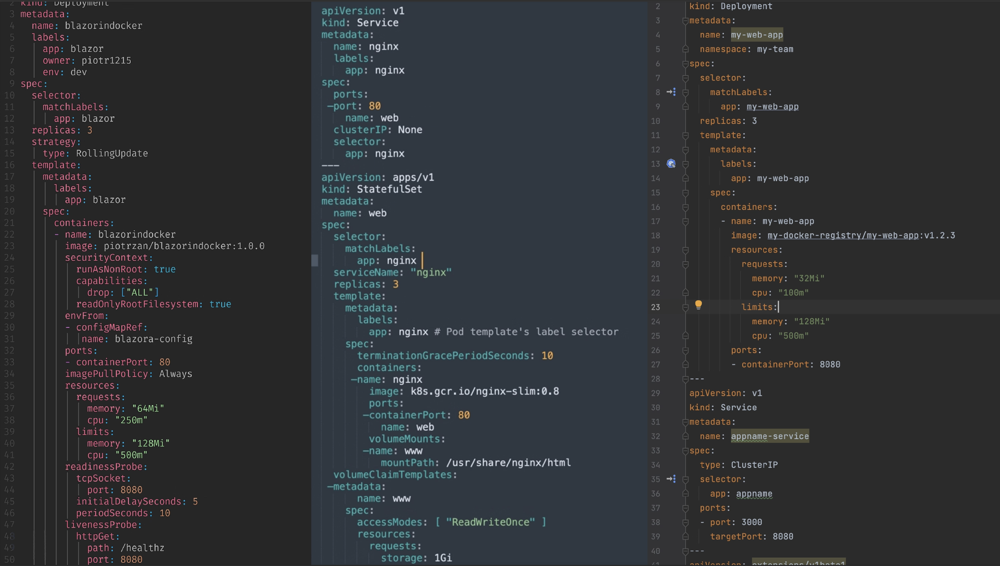
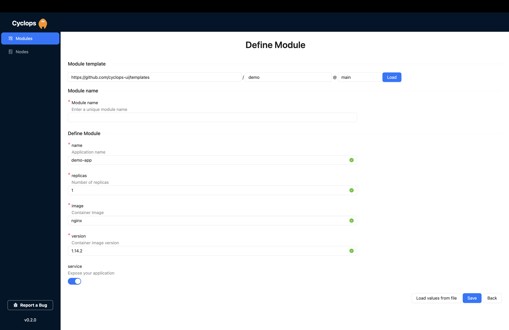
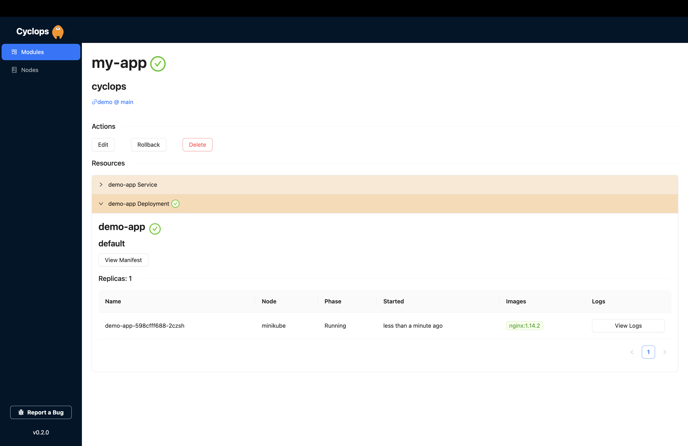

We perceive things by the way we interact with and understand them. To an infrastructure team, Kubernetes is a great way to scale and manage applications, but for a frontend/backend developer, It may seem complicated and stressful.

Kubernetes introduces many concepts and terminologies (deployments, services, pods…) that take time to grasp and even more time to master. But devs sometimes have to interact with them weekly, if not daily.

Through our experience and research, we identified the three most common ways in which developers engage with Kubernetes.

So, what does Kubernetes look like through the lens of a developer?

### Support us 🙏


Before we start, we would love it if you starred our [open-source repository](https://github.com/cyclops-ui/cyclops) and helped us get our
tool in front of other developers ⭐

## Touchpoints

Depending on the structure and development workflow of the company, developers either do not interact with Kubernetes at all because automated processes and scripts are doing it, or they interact with Kubernetes through three touchpoints:

1. **1. configuration files of their application**
2. **2. deploying their application in the K8s cluster**
3. **3. monitoring their applications**

### Configuration files



Configuration files tell Kubernetes how to handle an application. They are declarative, meaning you write the result you want to see rather than the steps to get there.

Most commonly written in [YAML](https://yaml.org/), these files are large and complex to read and understand. And being written in YAML comes with its challenges (and [quirks](https://noyaml.com/)) since it is an additional programming language that devs need to learn.

Mistakes in configurations are hard to spot and rectify but are a **BIG** deal. Even if you coded your app perfectly with no bugs whatsoever (hypothetically 😅), a mistake in the config could mean that your app just won't run.

### Deploying

Deploying your application is the process of starting your app in the Kubernetes cluster. The native way of doing this is with `kubectl`.

[`kubectl`](https://kubernetes.io/docs/reference/kubectl/) is the **command line tool** for Kubernetes. Being a command line tool/interface is something we should take into consideration. Senior devs should be accustomed to CLIs, but junior devs still might be timid. Getting accustomed to `kubectl` adds a new layer to the learning curve.

However, deploying requires more than knowledge of the available commands of `kubectl`; it also requires an understanding of the context and how it manipulates Kubernetes objects.

### Monitoring

Now that our devs have configured and deployed their application, they are done, right? Well, no.
The application probably has its fair share of bugs and issues, and they are expected to be able to monitor them and fix them when needed.

Finding out what is wrong with your app inside the Kubernetes cluster is **not straightforward**. Devs need to understand the objects that are in the cluster and how they interact with each other.

For instance, to fetch your app's logs, you need to know that it is run in a Pod. That Pod is located in a Replica Set, which itself is located inside a Deployment. You must understand these relationships while rummaging through your K8s resources with `kubectl`.

## Developer Platforms

This is just the tip of the iceberg when it comes to Kubernetes. Its complexity drastically elongates onboarding time for new devs, and all the additional steps introduced slow down development cycles.

Companies usually have a dedicated team to deal with infrastructure and Kubernetes. When developers encounter issues or need help, they turn to these teams. But you can imagine that when dealing with something as complex as Kubernetes, needing help is a common occurrence.

This is why we are seeing the rise of developer platforms, which reduce friction between developer and infrastructure teams. A good platform makes the development cycle of creating, updating, and deploying as smooth and straightforward as possible.

### Cyclops - Kubernetes platform made for developers

[Cyclops](https://github.com/cyclops-ui/cyclops) is a fantastic open-source developer tool that abstracts Kubernetes's complexities behind a simple graphical user interface. We call it a platform because your infrastructure teams can customize the UI to suit your specific needs and wants.

So, how does Cyclops solve the issues mentioned above?

1. With Cyclops, your developers never directly interact with configuration files. You create a template, which is then rendered for the developers as a form. This avoids the need to learn languages like YAML and has the added benefit of allowing you to add validations to their input, making it harder for developers to make mistakes.
2. Once the developers have specified what they need with Cyclops' help, deploying their application is as simple as clicking a button.
3. Now that they have deployed their app, Cyclops makes it easy to monitor its state via its user interface. The application's details are easily accessible and include all the resources (and logs) it uses.

Let's see it in action!

The installation is just a two-step process, but there are a few [prerequisites](https://cyclops-ui.com/docs/installation/prerequisites), with the main thing being a Kubernetes cluster.

So once you have your cluster up and running, you can install Cyclops with the command below:

```bash
kubectl apply -f https://raw.githubusercontent.com/cyclops-ui/cyclops/blogs-demo/install/cyclops-install.yaml
```

And once it's successfully installed (which could take a minute or two), you can access it with:

```bash
kubectl port-forward svc/cyclops-ui 3000:3000 -n cyclops
```

Cyclops should now be accessible in your browser at [http://localhost:3000](http://localhost:3000/).

Now, by clicking on the `Add Module` button, you will be taken to this screen:



We created a default template for you, but this screen is highly customizable (you can try out [your own Helm charts](https://cyclops-ui.com/docs/installation/demo/new_module)!). Now, instead of reading and writing YAML, developers can fill out these fields by clicking the save button, and their application will be deployed!



This next screen represents the detailed view of your newly deployed application. Here, you can see all the specified resources (and easily access the logs 😉). If anything goes wrong, it will be visible here!

If you wish to change something in the configuration (like adding more replicas of your app), click on the `Edit` button. You will be taken to a screen similar to the first one, where you can make those changes, again not even knowing that you are dealing with YAML underneath.

## Wrapping up

We hope this article did a good job of showcasing some of the ways developers are struggling with Kubernetes and a potential solution that you could consider next time you or your devs engage with it.

If you are running into issues with Kubernetes or have devs who are pestering you with K8s-related questions, consider supporting us by giving us a star on our GitHub [repository](https://github.com/cyclops-ui/cyclops) ⭐
